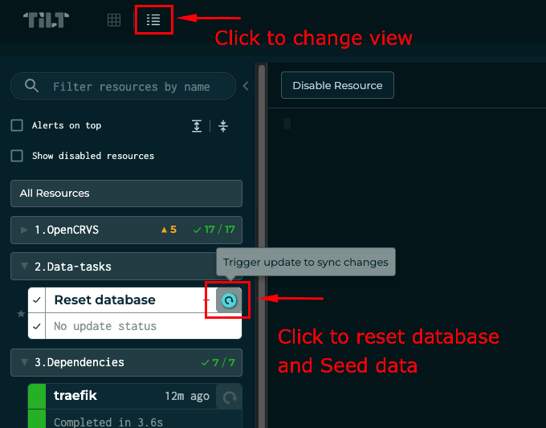

# 🚧 Work in Progress

Please note that not all features from the Docker Swarm solution are supported yet.

**Implemented features**

- Data migration
- Data seeding

**Limitations:**
- Manual Helm installation and upgrade only
- Manual initial user configuration for MinIO, MongoDB, Elasticsearch
- No data reset feature available
- Any kind of secrets (Logins and passwords, etc) should be created manually 

---

# General Information

This repository is used to store infrastructure code for deploying OpenCRVS.

---


# Developing OpenCRVS with Kubernetes

## Prerequisites

Hardware requirements:
- 16G RAM

Ensure you have one of the following solutions installed on your laptop:
- [**Recommended**]: Docker Desktop (with Kubernetes enabled): https://www.docker.com/products/docker-desktop/. Please check following:
  - Enable host networking
  - Enable Kubernetes
  - Ensure docker-desktop is configured to use at least 16G of RAM
- Minikube: https://minikube.sigs.k8s.io/docs/. For minikube linux (Ubuntu) users please ensure you gave unlimitted amount of memory and tunnel is running on localhost:
  ```
  minikube start --memory=no-limits
  minikube tunnel -c --bind-address='127.0.0.1'
  ```
**NOTE:** Any other Kubernetes solution for desktop should work as well. Please check to LoadBalancer and kubernetes services setup if you are not able to access service.


You will also need the following tools for running the local development environment:
- Git: https://git-scm.com/downloads
- Helm: https://helm.sh/
- Kubectl: https://kubernetes.io/docs/tasks/tools/
- Tilt: https://tilt.dev/

**NOTE:** This guide does not cover the installation of these prerequisites.

---

## For OpenCRVS Core Developers

You need to clone the [opencrvs-core](https://github.com/opencrvs/opencrvs-core) and [infrastructure](https://github.com/opencrvs/infrastructure) repositories. If these repositories are already on your laptop, ensure they are in the same folder.

1. Create a new folder or use an existing folder to store the repositories.
2. Open a terminal (command line) and navigate to the folder.
3. Clone the OpenCRVS Core repository:
    ```bash
    git clone git@github.com:opencrvs/opencrvs-core.git
    ```
4. Clone the Infrastructure repository:
    ```bash
    git clone git@github.com:opencrvs/infrastructure.git
    ```
    **NOTE:** This step is optional, tilt should be able to checkout infrastructure directory
5. Change directory to the OpenCRVS Core repository:
    ```bash
    cd opencrvs-core
    ```
6. Run Tilt:
    ```bash
    tilt up
    ```
7. Navigate to [http://localhost:10350/](http://localhost:10350/)
8. Once all container images are up and running your environment will be available at https://opencrvs.localhost


**NOTE:** On local environment you need manually access self signed certificate for the following URLs:
- https://login.opencrvs.localhost/
- https://gateway.opencrvs.localhost/ping
- https://register.opencrvs.localhost/ping
- https://countryconfig.opencrvs.localhost/ping


---

## For OpenCRVS Country Config Developers

Please follow official documentation how to setup your own country configuration at [Set-up your own, local, country configuration](https://documentation.opencrvs.org/setup/3.-installation/3.2-set-up-your-own-country-configuration).
You need to fork (clone) the [opencrvs-countryconfig](https://github.com/opencrvs/opencrvs-countryconfig) repository and clone the [infrastructure](https://github.com/opencrvs/infrastructure) repository. If repositories are already on your laptop, ensure they are in the same parent folder, for example:
```
repositories/
    infrastructure
    opencrvs-countryconfig
    ...
```

**Step by step instruction**

1. Create a new folder or use an existing folder to store the repositories. For example folder could be located at your home directory or in documents:
   ```bash
   mkdir ~/Documents/repository
   ```
2. Open a terminal (command line) and navigate to the folder.
   ```bash
   cd ~/Documents/repository
   ```
3. Clone OpenCRVS Country Config repository:
    
    For county config use:
    ```bash
    git clone https://github.com/opencrvs/opencrvs-countryconfig
    ```
    For your own fork use:
    ```bash
    git clone git@github.com:<your-github-account>/<your-repository>.git
    ```
4. Clone the Infrastructure repository:
    ```bash
    git clone git@github.com:opencrvs/infrastructure.git
    ```
    **NOTE:** This step is optional, tilt should be able to checkout infrastructure directory
5. Change directory to country config (your own) repository:
    
    For county config use:
    ```bash
    cd opencrvs-countryconfig
    ```
    For your own fork use:
    ```bash
    cd <your-repository>
    ```
7. Run Tilt:
    ```bash
    tilt up
    ```
8. Navigate to [http://localhost:10350/](http://localhost:10350/)
9. Once all container images are up and running your environment will be available at https://opencrvs.localhost

**NOTE:** On local environment you need manually access self signed certificate for the following URLs:
- https://login.opencrvs.localhost/
- https://gateway.opencrvs.localhost/ping
- https://register.opencrvs.localhost/ping
- https://countryconfig.opencrvs.localhost/ping

## Reset database / Seed data

1. Navigate to [http://localhost:10350/](http://localhost:10350/)
2. Scroll to section `2.Data-tasks` and find resource `Reset database`
3. Run resource using reload button

See screenshot for more information:


## Common issues

### Container start is failing with ImagePullBackOff

Check image tag was set properly, use `kubectl`, adjust value in `kubernetes/opencrvs-services/values-dev.yaml`
- Usually for repository your are working tag is `local`, e/g country config repository should have `local` tag only for countryconfig.
- Check tag exists on docker hub (or any other repository)

### Reset local environment

Draft and working way is to restart docker desktop

### Troubleshooting connectivity inside Kubernetes cluster

1. Issue fresh token:

  ```bash
  USERNAME=o.admin
  SUPER_USER_PASSWORD=password
  curl -X POST "http://auth.opencrvs-dev.svc.cluster.local:4040/authenticate-super-user" \
      -H "Content-Type: application/json" \
      -d '{
        "username": "'"${USERNAME}"'",
        "password": "'"$SUPER_USER_PASSWORD"'"
      }'
  ```

2. Check gateway host:
  ```bash
    GATEWAY_HOST=http://gateway.opencrvs-dev.svc.cluster.local:7070
    curl -X GET \
        -H "Content-Type: application/json" \
        -H "Authorization: Bearer ${token}" \
        ${GATEWAY_HOST}/locations?type=ADMIN_STRUCTURE&_count=0
  ```
3. Check config host:
  ```bash
  curl -v -X GET \
      -H "Content-Type: application/json" \
      -H "Authorization: Bearer ${token}" \
      http://config.opencrvs-dev.svc.cluster.local:2021/locations?type=ADMIN_STRUCTURE&_count=0
  ```
4. Check Hearth:
  ```bash
  curl -v http://hearth.opencrvs-deps-dev.svc.cluster.local:3447/fhir/Location
  ```

### Login/Client service is not responding: Check login logs
```
2025/03/19 07:53:38 [error] 15#15: *1 upstream timed out (110: Connection timed out) while connecting to upstream, client: 10.1.3.102, server: localhost, request: "GET /api/countryconfig/login-config.js HTTP/1.1", upstream: "http://10.100.14.175:3040/login-config.js", host: "login.opencrvs.localhost", referrer: "https://login.opencrvs.localhost/"
```

Solution: restart nginx inside login container or delete login pod
```
nginx -s reload
```


---

# Running OpenCRVS on Kubernetes

## Prerequisites for Kubernetes Cluster

### Storage

Ensure your cluster has a storage class with encryption, or encryption is implemented at the filesystem level:

- **For existing OpenCRVS installations:**
  Make sure the cluster has at least the `hostpath` storage class configured and directories on the filesystem should point to encrypted partitions.
  `hostpath` is the best option for migration from Docker Swarm to Kubernetes; it allows data to remain untouched. Data can be migrated to more robust storage later, such as `local` or `nfs` volumes after OpenCRVS migration to Kubernetes.

- **For new installations:**
  - Please check the available storage options in the official documentation: [Kubernetes Volumes Documentation](https://kubernetes.io/docs/concepts/storage/volumes/) and [Kubernetes Storage Classes Documentation](https://kubernetes.io/docs/concepts/storage/storage-classes/#provisioner).
  - The recommended storage class for new installations is NFS.

Additionally, explore all possible options for CSI (Container Storage Interface) at the [CSI GitHub repository](https://github.com/kubernetes-csi/).

**NOTE:** Depending on your available hardware resources, you may optimize the installation by splitting data across different types of volumes. For example:
- `Hostpath` works better for Elasticsearch.
- `NFS` is the best option for MinIO and Mongo (or Postgres).

---
### Cert-manager

cert-manager is optional component for traefik and provides an easy way to issue multiple SSL certificates and share it within multiple traefik pods.

If your installation use custom SSL stored as secrets cert-manager is not required.

Recommended way to install cert-manager is a helm chart, see official documentation for more details how to install cert-manager: https://cert-manager.io/docs/installation/helm/

---

### traefik custom changes

traefik is used to proxy OpenCRVS services behind load balancer on kubernetes cluster.

Please change default traefik certificate with your own wildcard or SANs certificate by following guide at https://doc.traefik.io/traefik/https/tls/#default-certificate

If cert-manager is used create `Certificate manifest at traefik namespace:

```yaml
apiVersion: cert-manager.io/v1
kind: Certificate
metadata:
  name: k8s-opencrvs-dev-ssl
  namespace: traefik
spec:
  dnsNames:
  - '*.<your domain>'
  - <your domain>
  issuerRef:
    kind: ClusterIssuer
    name: <dns-cluster-issuer>
  secretName: traefik-cert-tls
```

Make sure certificate was issued.
```
kubectl get cert
```

Create default tls store traefik:
```yaml
apiVersion: traefik.io/v1alpha1
kind: TLSStore
metadata:
  name: default
  namespace: traefik
spec:
  defaultCertificate:
    secretName: traefik-cert-tls

```


## [🚧 ] Manual deployment guide

TODO: Add steps with middleware installation:
- traefik
- dependencies


1. Clone this repository
    ```bash
    git clone https://github.com/opencrvs/infrastructure.git
    ```
2. Create yaml file with custom values for your installation:
   ```yaml
   # Kubernetes load balancer domain used by traefik as entrypoint
   hostname: <you domain>
   # OpenCRVS Core image tag
   image:
     tag: develop
   # Your country image repository and tag
   countryconfig:
     image:
       name: opencrvs/ocrvs-countryconfig
       tag: develop
   ```
   **NOTE:** Please refer to [opencrvs-services/README.md](charts/opencrvs-services/README.md) for full list of options.
3. Install OpenCRVS:
   ```
   helm install opencrvs charts/opencrvs-services
   ```
   **NOTE:** Data seed will run only on `install`, don't use `update --install` for first installation or run data-seeder manually.

# [🚧  Coming soon] Server environment migration

TODO: Migration from docker swarm to kubernetes guide

# Useful Links

- [Kubernetes Volumes Documentation](https://kubernetes.io/docs/concepts/storage/volumes/)
- [Kubernetes Storage Classes Documentation](https://kubernetes.io/docs/concepts/storage/storage-classes/#provisioner)
