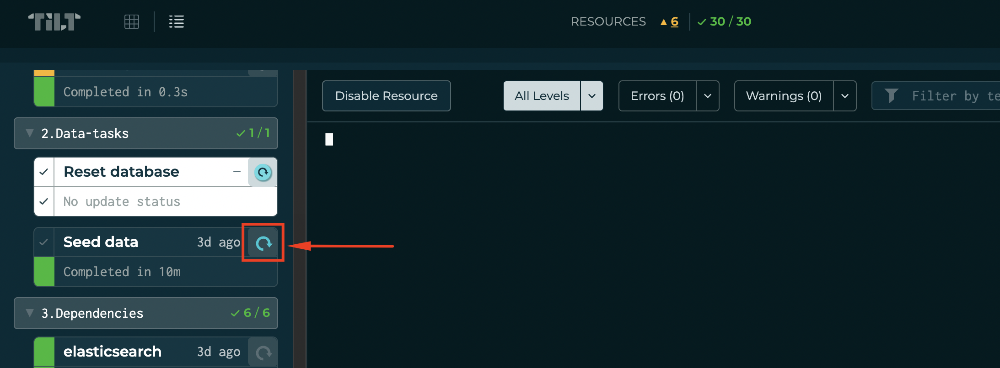
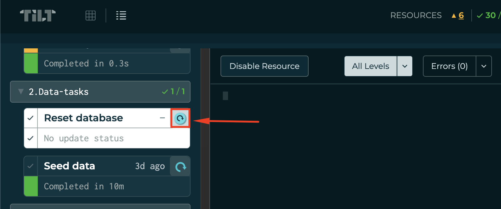

# 🚧 Work in Progress

> NOTE:
> All scripts within this repository are relevant to OpenCRVS version 1.8.0 and higher.

Please note that not all features from the Docker Swarm solution are supported yet and not all pipelines are implemented

---

# General Information

This document provides guidance on running OpenCRVS both locally (on your PC or laptop) and on server environments using Kubernetes. It is intended for developers contributing to OpenCRVS, DevOps engineers deploying OpenCRVS in various environments, and anyone interested in installing, running, or testing OpenCRVS features.

# Repository content

- [charts](charts), OpenCRVS helm charts
- [github-runner](github-runner), configuration files required to deploy self-hosted runner
- [terraform-templates](terraform-templates), configuration templates to deploy cloud environments on different platforms
- [examples](examples), pre-defined values for helm charts and additional documentation how to deploy OpenCRVS

# Quickstart

> **NOTE:** Before running commands from Quickstart instructions make sure your kubernetes cluster meets all requirements.

Check quickstart instructions how to deploy OpenCRVS to Kubernetes cluster at [charts/opencrvs-services](charts/opencrvs-services/README.md#-quickstart)

---

# System requirements

## Desktop requirements

### Hardware requirements
- 16G RAM
- 8 CPU (at least Intel 8th generation)
- 100G free storage space

### Software requirements

| Tool       | Description |
| ---------- | ----------- |
| Docker     | Docker engine and command-line tool for building images. [Learn more](https://www.docker.com/)|
| Kubernetes | For macOS and Windows users, we recommend Docker Desktop with Kubernetes; for Linux users, we recommend Minikube. More information about setting up Kubernetes can be found in the [Docker engine with Kubernetes cluster](#docker-engine-with-kubernetes-cluster) section. |
| Git        | Git command-line tool for checking out code. [Download Git](https://git-scm.com/downloads). |
| kubectl    | Kubernetes command-line tool. [Documentation](https://kubernetes.io/docs/tasks/tools/). |
| helm       | Helm, a template engine for managing Kubernetes manifests. [Learn more](https://helm.sh/). |
| tilt       | Tilt for live development of Kubernetes applications. [Learn more](https://tilt.dev/). |

---

**NOTE:**
- This guide does not cover the installation of these prerequisites.
- OpenCRVS team has limited capacity to test different configurations. Feel free to submit an issue on GitHub if something doesn't work in your hardware or software setup.

---

### Docker engine with Kubernetes cluster

#### Docker Desktop (with Kubernetes enabled)

Docker desktop with Kubernetes enabled is recommended for development environment on MacOS and Windows. Get more details how to install docker desktop on official website https://www.docker.com/products/docker-desktop/.

Additional configuration for Docker desktop:
  - Enable host networking to be able access http://opencrvs.localhost, otherwise you will need to configure additional tools like proxy.
  - Enable Kubernetes and configure kubectl with correct context
  - Ensure docker-desktop is configured to use at least 12G or more RAM
  - Ensure Storage is set up at least 100G

#### Minikube

Minikube (with docker driver) is recommended way to run Kubernetes on linux. However docker engine is still required for Tilt. Please check official documentation on https://minikube.sigs.k8s.io/docs/.

**NOTE**: 
- Docker support is still experimental for minikube, but it gives better performance in comparison to alternative solutions.


Additional settings for linux (Ubuntu) users:
  - Add following values to /etc/sysctl.conf:
    ```
    fs.inotify.max_user_watches = 524288
    fs.inotify.max_user_instances = 512
    ```
  - Start minikube with unlimited amount of memory:
    ```
    minikube start --memory=max
    ```
  - Start load balancer (tunnel) on localhost:
    ```
    minikube tunnel -c --bind-address='127.0.0.1'
    ```

---

**NOTE:** Any other Kubernetes solution for desktop should work as well. Please check to LoadBalancer and kubernetes services setup if you are not able to access service.

---

## Server requirements

> TODO: Add server requirements

# Developing OpenCRVS with Kubernetes

Kubernetes is the easiest option to run OpenCRVS locally on your PC or Laptop and test all features and functionality.
Before running make sure all hardware and software requirements are met.

Once you make sure your development environment is ready for running OpenCRVS we are recommending you start from "For OpenCRVS DevOps" configuration and get familiar with all tools used to deploy OpenCRVS locally (tilt, kubectl, helm). In that particular configuration all docker images are pulled from our registry and OpenCRVS application is starting with Falajaland demo data. No additional actions are needed from your side.


The OpenCRVS team uses [Tilt](https://tilt.dev/) to manage the local development environment. Depending on your role and development needs, the following configurations (Tiltfiles) are available:


- [DevOps developers](#for-opencrvs-devops), This basic configuration is designed for Helm chart development. Tilt uses official OpenCRVS release images along with the Farajaland demo data. Docker images are pulled from the OpenCRVS container registry.
- [Country config developers](#for-opencrvs-country-config-developers), In this setup, OpenCRVS Core images are pulled from the OpenCRVS container registry. The Country Config image is built locally using Tilt's live update feature, so your code changes are reflected almost immediately. Typically, you’ll be working with your own fork of the Country Config repository.
- [Core developers](#for-opencrvs-core-developers), This configuration builds OpenCRVS Core images locally with live updates enabled, allowing near-instant reflection of code changes. By default, the Country Config image is pulled from the OpenCRVS container registry. If you maintain your own fork of the Country Config repository and container registry, you should update the Tiltfile to use your own registry.


## For OpenCRVS DevOps

1. Clone this repository:
   ```
   git clone https://github.com/opencrvs/infrastructure.git
   ```
2. Run:
   ```
   tilt up
   ```
3. Navigate to [http://localhost:10350/](http://localhost:10350/)
4. Run [Data seed](#initial-data-seeding-with-tilt) resource
5. Once all container images are up and running your environment will be available at http://opencrvs.localhost


## For OpenCRVS Country Config Developers

Please follow official documentation how to setup your own country configuration at [Set-up your own, local, country configuration](https://documentation.opencrvs.org/setup/3.-installation/3.2-set-up-your-own-country-configuration).
You need to fork (clone) the [opencrvs-countryconfig](https://github.com/opencrvs/opencrvs-countryconfig) repository and clone the [infrastructure](https://github.com/opencrvs/infrastructure) repository. If repositories are already on your laptop, ensure they are in the same parent folder, for example:
```
repositories/
    infrastructure
    opencrvs-countryconfig
    ...
```

**Step by step instruction**

1. Create a new folder or use an existing folder to store the repositories. For example folder could be located at your home directory or in documents:
   ```bash
   mkdir ~/Documents/repository
   ```
2. Open a terminal (command line) and navigate to the folder.
   ```bash
   cd ~/Documents/repository
   ```
3. Clone OpenCRVS Country Config repository:
    
    For county config use:
    ```bash
    git clone https://github.com/opencrvs/opencrvs-countryconfig
    ```
    For your own fork use:
    ```bash
    git clone git@github.com:<your-github-account>/<your-repository>.git
    ```
4. Clone the Infrastructure repository:
    ```bash
    git clone git@github.com:opencrvs/infrastructure.git
    ```
    **NOTE:** This step is optional, tilt should be able to checkout infrastructure directory
5. Change directory to country config (your own) repository:
    
    For county config use:
    ```bash
    cd opencrvs-countryconfig
    ```
    For your own fork use:
    ```bash
    cd <your-repository>
    ```
7. Run Tilt:
    ```bash
    tilt up
    ```
8. Navigate to [http://localhost:10350/](http://localhost:10350/)
9. Run [Data seed](#initial-data-seeding-with-tilt) resource.
10. Once all container images are up and running your environment will be available at http://opencrvs.localhost


## For OpenCRVS Core Developers

You need to clone the [opencrvs-core](https://github.com/opencrvs/opencrvs-core) and [infrastructure](https://github.com/opencrvs/infrastructure) repositories. If these repositories are already on your laptop, ensure they are in the same folder.

1. Create a new folder or use an existing folder to store the repositories.
2. Open a terminal (command line) and navigate to the folder.
3. Clone the OpenCRVS Core repository:
    ```bash
    git clone git@github.com:opencrvs/opencrvs-core.git
    ```
4. Clone the Infrastructure repository:
    ```bash
    git clone git@github.com:opencrvs/infrastructure.git
    ```
    **NOTE:** This step is optional, tilt should be able to checkout infrastructure directory
5. Change directory to the OpenCRVS Core repository:
    ```bash
    cd opencrvs-core
    ```
6. Run Tilt:
    ```bash
    tilt up
    ```
7. Navigate to [http://localhost:10350/](http://localhost:10350/)
8. Run [Data seed](#initial-data-seeding-with-tilt) resource.
9. Once all container images are up and running your environment will be available at http://opencrvs.localhost

---

## Initial data seeding with tilt

This task should run only once on fresh environment after environment installation.

1. Navigate to [http://localhost:10350/](http://localhost:10350/)
2. Scroll to section `2.Data-tasks` and find resource `Reset database`
3. Run resource using reload button
   
4. Once data seeding completed you will be able to login using default credentials, see [4.1.4 Log in to OpenCRVS locally](https://documentation.opencrvs.org/setup/3.-installation/3.1-set-up-a-development-environment/3.1.4-log-in-to-opencrvs-locally)

## Reset database and Seed data with tilt

1. Navigate to [http://localhost:10350/](http://localhost:10350/)
2. Scroll to section `2.Data-tasks` and find resource `Reset database`
3. Run resource using reload button
   
4. Once data reset completed you will be able to login using default credentials, see [4.1.4 Log in to OpenCRVS locally](https://documentation.opencrvs.org/setup/3.-installation/3.1-set-up-a-development-environment/3.1.4-log-in-to-opencrvs-locally).

## Common issues

### Your session has expired. Please login again.

This issue often appear on local development environment.
Easiest way to solve the issue:
```
kubectl delete pod --all -n opencrvs-dev
```

### Container start is failing with ImagePullBackOff

Check image tag was set properly, use `kubectl`, adjust value in `kubernetes/opencrvs-services/values-dev.yaml`
- Usually for repository your are working tag is `local`, e/g country config repository should have `local` tag only for countryconfig.
- Check tag exists on docker hub (or any other repository)

### Reset local environment

Draft and working way is to restart docker desktop

### Troubleshooting connectivity inside Kubernetes cluster

1. Issue fresh token:

  ```bash
  USERNAME=o.admin
  SUPER_USER_PASSWORD=password
  curl -X POST "http://auth.opencrvs-dev.svc.cluster.local:4040/authenticate-super-user" \
      -H "Content-Type: application/json" \
      -d '{
        "username": "'"${USERNAME}"'",
        "password": "'"$SUPER_USER_PASSWORD"'"
      }'
  ```

2. Check gateway host:
  ```bash
    GATEWAY_HOST=http://gateway.opencrvs-dev.svc.cluster.local:7070
    curl -X GET \
        -H "Content-Type: application/json" \
        -H "Authorization: Bearer ${token}" \
        ${GATEWAY_HOST}/locations?type=ADMIN_STRUCTURE&_count=0
  ```
3. Check config host:
  ```bash
  curl -v -X GET \
      -H "Content-Type: application/json" \
      -H "Authorization: Bearer ${token}" \
      http://config.opencrvs-dev.svc.cluster.local:2021/locations?type=ADMIN_STRUCTURE&_count=0
  ```
4. Check Hearth:
  ```bash
  curl -v http://hearth.opencrvs-deps-dev.svc.cluster.local:3447/fhir/Location
  ```

### Login/Client service is not responding: Check login logs
```
2025/03/19 07:53:38 [error] 15#15: *1 upstream timed out (110: Connection timed out) while connecting to upstream, client: 10.1.3.102, server: localhost, request: "GET /api/countryconfig/login-config.js HTTP/1.1", upstream: "http://10.100.14.175:3040/login-config.js", host: "login.opencrvs.localhost", referrer: "https://login.opencrvs.localhost/"
```

Solution: restart nginx inside login container or delete login pod
```
nginx -s reload
```

**NOTE:** On AWS server may not respond due to Security group blocking rules. Check AWS Security groups and allow http traffic on port 80 between nodes.


### S3Error: The Access Key Id you provided does not exist in our records

Log example:
```
$ /app/node_modules/.bin/migrate-mongo up --file ./build/dist/src/migrate-mongo-config-hearth.js
ERROR: Could not migrate up 20230331182109-modify-minio-bucket-policy.js: The Access Key Id you provided does not exist in our records. S3Error: The Access Key Id you provided does not exist in our records.
    at parseError (file:///app/node_modules/minio/dist/esm/internal/xml-parser.mjs:20:13)
    at Module.parseResponseError (file:///app/node_modules/minio/dist/esm/internal/xml-parser.mjs:67:11)
```

Due to various reasons credentials may become out of sync between Dependencies and Application namespaces.

If you see following issue on local development environment run `copy_secrets` resource on Tilt dashboard and delete failed PODs.

If you see following issue on server environments sync secrets manually and delete failed PODs.

---

# Production deployment

 > [!NOTE]
 > 🚧 Work in Progress

## Prerequisites for Kubernetes Cluster

### Storage

Ensure your cluster has a storage class with encryption, or encryption is implemented at the filesystem level:

- **For existing OpenCRVS installations:**
  Make sure the cluster has at least the `hostpath` storage class configured and directories on the filesystem should point to encrypted partitions.
  `hostpath` is also the best option for migration from Docker Swarm to Kubernetes for On-Premise Deployment. Data can be migrated to more robust storage later.

- **For new installations:**
  - For Cloud Deployment please check your cloud provider documentation for available storage options. Usually all cloud providers have block and object storage available. E/g. AWS EBS, Azure Disk, Google Persistent Disk.
  - For On-Premise Deployment please check your hardware and software requirements. If you have a SAN or NAS storage available, you can use it as a persistent volume for OpenCRVS. The recommended storage class for new installations is [Kubernetes NFS Subdir External Provisioner](https://github.com/kubernetes-sigs/nfs-subdir-external-provisioner)

Additional documentation and resources:
- Container Storage Interface (CSI) at the [CSI GitHub repository](https://github.com/kubernetes-csi/).
- Official documentation at [Kubernetes Volumes Documentation](https://kubernetes.io/docs/concepts/storage/volumes/)
- [Kubernetes Storage Classes Documentation](https://kubernetes.io/docs/concepts/storage/storage-classes/#provisioner).

**NOTE:** Depending on your available hardware resources, you may optimize the installation by selecting appropriate storage classes for different data types. For example:

- **Block storage** (such as `hostPath`, AWS EBS, or Azure Disk) is ideal for databases like Elasticsearch, MongoDB, and Postgres. Block storage provides high performance, low latency, and strong data consistency, making it suitable for workloads that require frequent read/write operations and durability.
- **NFS (Network File System)** is a network-based storage solution that exposes file shares over the network. While NFS is often used for shared persistent volumes in Kubernetes, it is not true block storage. NFS is easy to set up and works well for sharing files between pods, but it can introduce performance bottlenecks, higher latency, and potential data consistency issues under heavy concurrent access. NFS is generally not recommended for high-performance databases, but can be suitable for shared file storage, logs, or application data that does not require strict consistency.
- **Object storage** (such as AWS S3, Azure Blob Storage, or MinIO) is better suited for storing unstructured data, backups, and large files. Object storage offers scalability and cost-effectiveness, but typically has higher latency and is not suitable for database persistent volumes.

**Example:**  
- Use a block storage class (e.g., `hostPath` or `local-path`) for your database persistent volumes to ensure fast and reliable access.
- Use NFS for shared application data, logs, or files that need to be accessed by multiple pods, but avoid using it for database storage.
- Use an object storage class (e.g., MinIO or S3) for storing user-uploaded files, backups, or exported reports, where scalability and accessibility are more important than low-latency access.

**Comparison Table:**

| Storage Type   | Use Case                        | Performance | Scalability | Data Consistency | Example StorageClass      |
|----------------|---------------------------------|-------------|-------------|------------------|--------------------------|
| Block Storage  | Databases                       | High        | Moderate    | Strong           | hostPath, EBS, local-path|
| NFS            | Shared files, logs, app data    | Moderate    | High        | Moderate         | nfs-subdir   |
| Object Storage | Backups, file storage           | Moderate    | High        | Eventual         | MinIO, S3                |

---
### Cert-manager

cert-manager is optional component for traefik and provides an easy way to issue multiple SSL certificates and share it within multiple traefik pods.

If your installation use custom SSL stored as secrets cert-manager is not required.

Recommended way to install cert-manager is a helm chart, see official documentation for more details how to install cert-manager: https://cert-manager.io/docs/installation/helm/

---

### traefik custom changes

traefik is used to proxy OpenCRVS services behind load balancer on kubernetes cluster.

Please change default traefik certificate with your own wildcard or SANs certificate by following guide at https://doc.traefik.io/traefik/https/tls/#default-certificate

If cert-manager is used create `Certificate manifest at traefik namespace:

```yaml
apiVersion: cert-manager.io/v1
kind: Certificate
metadata:
  name: k8s-opencrvs-dev-ssl
  namespace: traefik
spec:
  dnsNames:
  - '*.<your domain>'
  - <your domain>
  issuerRef:
    kind: ClusterIssuer
    name: <dns-cluster-issuer>
  secretName: traefik-cert-tls
```

Make sure certificate was issued.
```
kubectl get cert
```

Create default tls store traefik:
```yaml
apiVersion: traefik.io/v1alpha1
kind: TLSStore
metadata:
  name: default
  namespace: traefik
spec:
  defaultCertificate:
    secretName: traefik-cert-tls

```

## Deployment

Before moving forward with current section please make sure Traefik is installed and valid wildcard certificate is issued.

Prepare configuration:
1. Navigate to [Infrastructure examples](./examples)
2. Copy desired configuration to your laptop. You should get directory structure like:
    ```
    cert-manager
    dependencies
    opencrvs-services
    README.md
    traefik
    ```
3. Adjust default values for dependencies chart at `dependencies/values.yaml`. Check [Dependencies helm chart documentation](./charts/dependencies/README.md)
4. Deploy dependencies:
    ```
    ENV=dev
    helm upgrade --install opencrvs-deps oci://ghcr.io/opencrvs/opencrvs-dependencies-chart \
            --namespace "opencrvs-deps-${ENV}" \
            -f dependencies/values.yaml \
            --create-namespace
    ```
5. Adjust default values for OpenCRVS chart at `opencrvs-services/values.yaml`. Check [OpenCRVS helm chart documentation](./charts/opencrvs-services/README.md)
6. Deploy OpenCRVS:
    ```
    ENV=dev
    helm upgrade --install opencrvs oci://ghcr.io/opencrvs/opencrvs-services \
            --namespace "opencrvs-${ENV}" \
            -f opencrvs-services/values.yaml \
            --create-namespace
    ```

## Validate deployment

1. Switch context to OpenCRVS dependencies namespace and make sure all pods are up and running.
2. Switch context to OpenCRVS application namespace and make sure all pods are up and running
3. Make sure data migration job completed successfully:
   ```
   kubectl logs jobs/data-migration
   ```

4. Make sure initial data seed job completed successfully:
   ```
   kubectl logs jobs/data-seed
   ```

# Useful Links

- [Kubernetes Volumes Documentation](https://kubernetes.io/docs/concepts/storage/volumes/)
- [Kubernetes Storage Classes Documentation](https://kubernetes.io/docs/concepts/storage/storage-classes/#provisioner)
